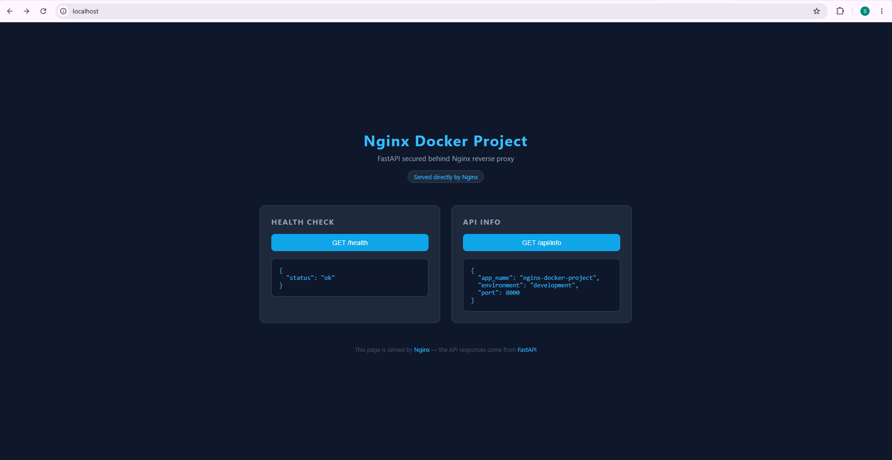
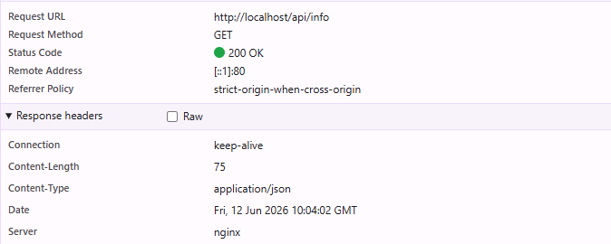

# Nginx Docker Project

A production-grade FastAPI application secured behind an Nginx reverse proxy,
fully containerized with Docker Compose.

## Architecture
Client → Nginx :80 → / (static HTML, served directly by Nginx)

→ /api/ (proxied to FastAPI :8000)

→ /health (proxied to FastAPI :8000)

Nginx is the only service exposed to the outside world. FastAPI runs internally
on a private Docker network — never directly accessible in production.

## Screenshots

### Dashboard


### Nginx Proxy Headers


> Notice `Server: nginx` and `Remote Address: [::1]:80` — 
> the API response is proxied through Nginx, FastAPI is never directly exposed.

## Prerequisites

- [Docker](https://docs.docker.com/get-docker/)
- [Docker Compose](https://docs.docker.com/compose/install/)

## Quick Start

```bash
git clone https://github.com/ShashiShukla-001/nginx-docker-project.git
cd nginx-docker-project
cp .env.example .env
docker compose up --build
```

Then open `http://localhost` in your browser.

## Environment Variables

| Variable | Description | Example |
|----------|-------------|---------|
| `APP_NAME` | Name of the application | `nginx-docker-project` |
| `APP_ENV` | Runtime environment | `development` or `production` |
| `APP_PORT` | Port FastAPI runs on internally | `8000` |
| `SECRET_KEY` | Secret key for the application | `your-secret-key-here` |

Never commit your `.env` file. Always generate a strong `SECRET_KEY`:

```bash
python -c "import secrets; print(secrets.token_hex(32))"
```

## Endpoints

| Method | Endpoint | Handler | Description |
|--------|----------|---------|-------------|
| GET | `/` | Nginx | Dashboard — static HTML served directly |
| GET | `/health` | FastAPI | Health check |
| GET | `/api/info` | FastAPI | App info from environment variables |
| GET | `/api/docs` | FastAPI | Auto-generated API documentation |

## Project Structure
nginx-docker-project/

├── .github/

│   └── workflows/          # CI validation

├── docs/

│   └── screenshots/        # README screenshots

├── nginx/

│   ├── nginx.conf          # Global Nginx config

│   └── conf.d/

│       └── default.conf    # Server block and proxy rules

├── app/

│   ├── main.py             # FastAPI application

│   ├── requirements.txt    # Python dependencies

│   └── Dockerfile          # App container definition

├── static/

│   └── index.html          # Frontend served directly by Nginx

├── docker-compose.yml      # Production orchestration

├── .env.example            # Environment variable template

└── README.md

## Development

The `docker-compose.override.yml` file adds local dev features automatically:

- Hot reload — code changes reflect instantly
- FastAPI directly accessible at `http://localhost:8000`
- No rebuild needed for code changes

```bash
# Start with hot reload
docker compose up

# Rebuild after Dockerfile or dependency changes
docker compose up --build

# Stop everything
docker compose down
```

## Security

- Nginx is the only exposed service — FastAPI has no public port in production
- `server_tokens off` — Nginx version hidden from response headers
- Non-root user inside the app container
- Secrets managed via environment variables, never hardcoded